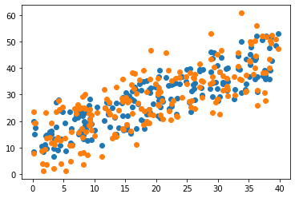
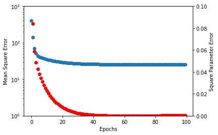

# What is `edudiff`?

`edudiff` is reverse mode automatic differentiation in the style of PyTorch.

`edudiff` requires computational nodes define local gradients, unlike Autograd or JAX which can synthesize these.

# Why `edudiff`?

You should know (roughly) how your tools work.

# What's provided?

Not much. `edudiff` is pedagogical and not meant as a tool. You should (of course) use PyTorch or JAX.

There's currently no accelerator support, but this could be added.

# What does it look like?

```python
%matplotlib inline
import matplotlib.pyplot as plt
import numpy as np

from edudiff import Value, gmap
```

## Scalar function gradients


```python
a = Value(5)
b = Value(8)
c = Value(2)

((a + c) * b + c).backward()

a.gradient, b.gradient, c.gradient
```

    (8, 7, 9)


## Linear Regression


```python
n_features, n_samples = 3, 200

xs = np.random.uniform(0, 40, size=(n_features, n_samples))
W = np.random.random((n_features,))
err = 5 * np.random.normal(size=(n_samples))

y = W @ xs + err
```


```python
plt.scatter(xs[0], (W @ xs))
plt.scatter(xs[0], y)
```




### Define and optimize a linear regression model


```python
xi = Value(xs, requires_gradient=False)
Wi = Value(np.random.random((n_features,)))

learning_rate = 1e-6

error = []
w_error = []
for _ in range(100):
    y_hat = Wi @ xi
    mse_loss = ((y_hat - y) ** 2).sum()
    gmap(mse_loss, lambda v: v.parents, lambda v: v.clear_gradient())
    
    mse_loss.backward()
    error.append(mse_loss.value / n_samples)
    w_error.append(np.mean((W - Wi.value) ** 2))
    
    Wi.value -= learning_rate * Wi.gradient

fig, ax = plt.subplots()
ax.scatter(np.arange(100), error)
ax.set_yscale("log")
ax.set_ylim([1, 1000])
ax.set_ylabel("Mean Square Error")

ax2 = ax.twinx()
ax2.scatter(np.arange(100), w_error, color="red")
ax2.set_ylim([0, 0.1])
ax2.set_ylabel("Square Parameter Error")
ax.set_xlabel("Epochs")
```


